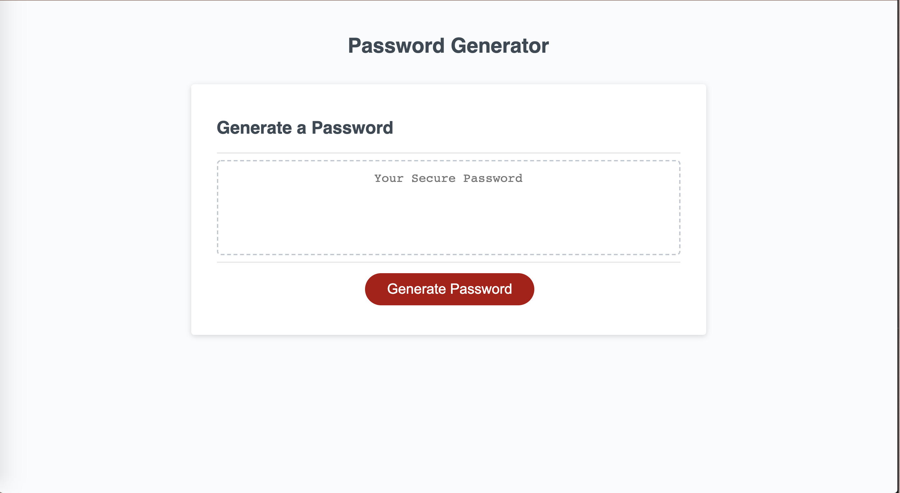
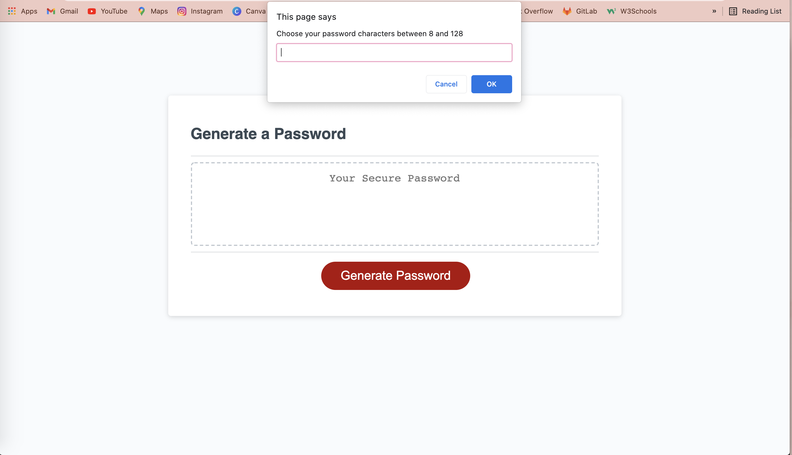
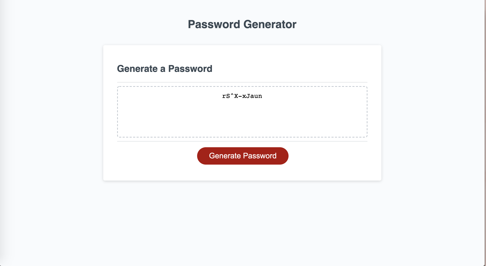

# Password-Generator

This project is focused on creating an application that randomly generates secured passwords based on specific criteria. This application will run in the browser featuring HTML, CSS, and JS code written to have a clean and minimal interface. Primarily, the employee will be able access sensitive data by generating a strong password that meets specific criteria for security purposes. In this codebase, you will find conditional statements throughout JavaScript code to create prompts of specific criteria to be answered that will validate selected characters to generate a secured password. Once all the prompts are answered, the password will be shown randomized in the browser.

Below are the images of the Password Generator:

Here is the URL to access the website directly:
<a href="https://gracetalks.github.io/Cynthia-Career-Portfolio/">Visit My Portfolio!</a>